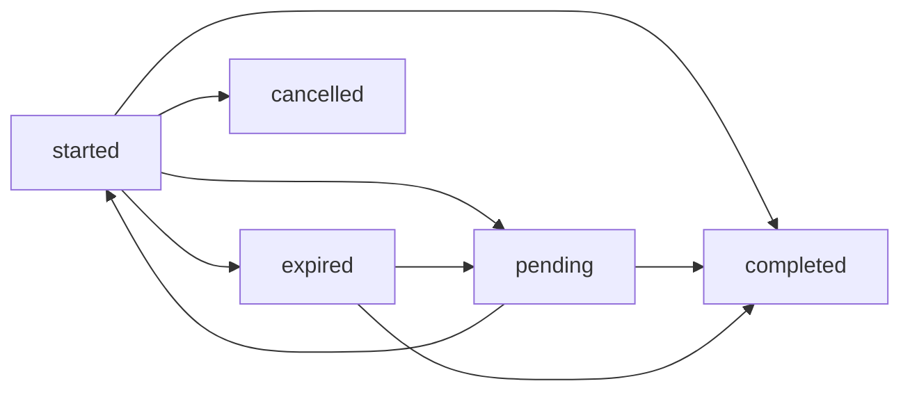
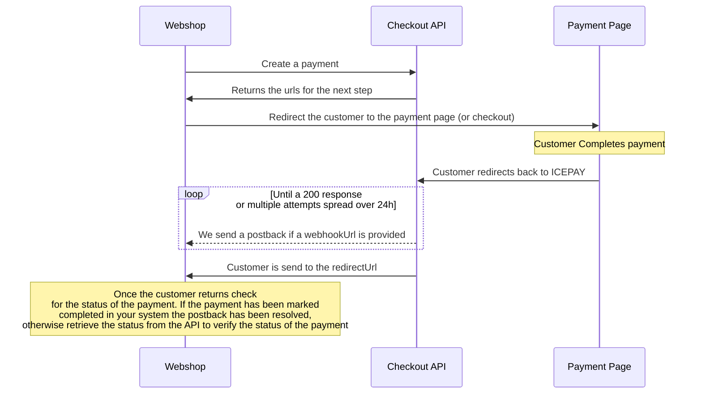

# Checkout API

## Authentication


To authenticate requests to the Checkout API we use ```Basic authentication```  
Your Merchant ID is used as the ```username```, your Merchant Secret is used as the ```password```

Both of these values can be obtained from the [ICEPAY Portal](https://portal.icepay.com) > ***Merchants*** > ***View Merchant***.  
They are then added into an Authorization header using the format ```Basic <base64 username:password\>```

???+ tip "Example"

    Merchant ID is 10000  
    Merchant Secret is xxxxxx  
    The base64 encoding of the password and username, 10000:xxxxxx, will result in ```MTAwMDA6eHh4eHh4```


Authentication is required for all request.

An ICEPAY Merchant can be set to test or live processing mode via the [ICEPAY Portal](https://portal.icepay.com)  
For an explanation, please see our [Testing page](/getting-started/onboarding/testing/)

## Creating a checkout
When creating a checkout no payment method has to be provided.  
The customer will be able to choose this on the [ICEPAY Checkout Page](/general/ICEPAY-Platform/payment-page/)

POST: ```https://checkout.icepay.com/api/payments```
```json
{
    "reference": "OR-123412", // Required string, max length of 255 characters
    "description": "Ice cream with sprinkles", // optional string,  max length of 255 characters, visible in the checkout. If absent the reference is used as the description.
    "amount": {
        "value": 299, // Required integer, in minor units and above zero
        "currency": "eur" // Required enum
    },
    "redirectUrl": "https://<redirectUrl>", // optional string, max length of 512 characters and https. This url is used to sent the customer back when the payment is completed or stopped
    "webhookUrl": "https://<postbackUrl>", // optional string, maximum length of 512 and https.
    "customer": {
        "email": "johndoe@example.com" // optional string, max length of 254 characters.
    }
}
```

A list of supported currencies can be found on the [Currencies page](/general/ICEPAY-Platform/currencies/)

???+ tip "Put a reference in the redirectUrl & webhookUrl"    
     You can customize the redirect and webhook urls. For example, you can put your order id in the urls.

=== "cURL"
    ```bash
    curl --silent --location --request POST 'https://checkout.icepay.com/api/payments' \
    --header 'Content-Type: application/json' \
    --header 'Authorization: Basic MTAwMDA6eHh4eHh4' \
    --data '{
        "reference": "ORD-16307",
        "description": "Icecream dipped in Sprinkels",
        "amount": {
            "value": 299,
            "currency": "eur"
        },
        "redirectUrl": "https://<redirectUrl>",
        "webhookUrl": "https://<postbackUrl>",
        "customer": {
            "email": "johndoe@example.com"
        }
    }'
    ```
=== "PHP (Laravel)"
    ```php
    $merchantId = '10000';
    $merchantSecret = 'xxxxxx';
    $body = [
        'reference' => 'ORD-16307',
        'description' => 'Ice cream dipped in Sprinkles',
        'amount' => [
            'value' => 299,
            'currency' => 'eur'
        ],
        'webhookUrl' => 'https://<redirectUrl>',
        'redirectUrl' => 'https://<postbackUrl>',
        'customer' => [
            'email' => 'johndoe@example.com',
        ],
    ];

    $response = Http::withBasicAuth($merchantId, $merchantSecret)
        ->post('https://checkout.icepay.com/api/payments', $body);

    Log::debug($response->json());
    ```

=== "Javascript (Node.js)"
    ```js
    const merchantId = '10000';
    const merchantSecret = 'xxxxxx';

    const headers = {
        'Content-Type': 'application/json',
        'Authorization': `Basic ${btoa(`${merchantId}:${merchantSecret}`)}`
    };

    const body = JSON.stringify({
        "reference": "ORD-16307",
        "description": "Icecream dipped in Sprinkels",
        "amount": {
            "value": 299,
            "currency": "eur"
        },
        "webhookUrl": "https://<postbackUrl>",
        "redirectUrl": "https://<redirectUrl>",
        "customer": {
            "email": "johndoe@example.com"
        }
    });

    const result = await fetch('https://checkout.icepay.com/api/payments', {
        method: 'POST',
        headers: headers,
        body: body,
    });

    console.log(await result.json());
    ```

Example response when a payment has been successfully created:
```json
    {
        "key": "pi-01j1ps8zf4jgnk0c3dnd477sp1",
        "status": "started",
        "amount": {
            "value": 299,
            "currency": "eur"
        },
        "paymentMethod": null,
        "description": "Ice cream dipped in Sprinkles",
        "reference": "ORD-16307",
        "webhookUrl": "https://<redirectUrl>",
        "redirectUrl": "https://<postbackUrl>",
        "merchant": {
            "id": 10000,
            "name": "IJs winkel"
        },
        "isTest": false,
        "refunds": [],
        "createdAt": "2024-07-01T09:16:06.500000Z",
        "expiresAt": "2024-07-01T13:16:06.433802Z",
        "updatedAt": "2024-07-01T09:16:06.500000Z",
        "meta": {
            "customer": {
                "email": "johndoe@example.com"
            }
        },
        "links": {
            "checkout": "https://checkout.icepay.com/checkout/pi-01j1ps8zf4jgnk0c3dnd477sp1",
            "documentation": "https://docs.icepay.com"
        }
    }
```

The customer can be redirected to the checkout url in the links object to complete the payment. The key provided in the response is the unique identifier of the payment. This key is also used to create a refund or to retrieve the payment.  

???+ tip "Extend payment"

    By default, the payment will stay open for 4 hours. By providing the ```expireAfter``` property this can be extended up to 31 days.  
    The expireAfter property will take the amount of time it will stay open in minutes as an integer between 0 and 44640. This can be useful when, for example, printing the Checkout URL as a QR code on an invoice.

### Providing a payment method

When the customer chooses a payment method in your checkout, the request body can be modified to include a paymentMethod object.

POST: ```https://checkout.icepay.com/api/payments```
```json
{
    "reference": "ORD-16307", // Required string, max length of 255 characters
    "description": "Ice cream dipped in Sprinkles", // optional string,  max length of 255 characters, visible in the checkout. If absent the reference is used as the description.
    "amount": {
        "value": 299, // Required integer, in minor units and above zero
        "currency": "eur" // Required enum
    },
    "paymentMethod": {
        "type": "card" // Optional enum: ideal, card, bancontact, paypal etc.
    },
    "redirectUrl": "https://<redirectUrl>", // optional string, max length of 512 characters and https. This url is used to sent the customer back when the payment is completed or stopped
    "webhookUrl": "https://<postbackUrl>", // optional string, maximale lengte 512 en https.
    "customer": {
        "email": "johndoe@example.com" // optional string, max length of 254 characters.
    }
}
```

| Payment Method    | Enum |
| -------- | ------- |
| [Bancontact](/payment-methods/bank-methods/bancontact/)  | bancontact    |
| [iDEAL](/payment-methods/bank-methods/ideal/) | ideal     |
| [Online Überweisen](/payment-methods/bank-methods/online-uberweisen/)    | onlineueberweisen    |
|[Visa & Mastercard](/payment-methods/cards/visa-mastercard)|card|
|[PayPal](/payment-methods/wallets/paypal/)| paypal|
|[EPS](/payment-methods/bank-methods/EPS/)| EPS|
|[Pay by Bank](/payment-methods/bank-methods/pay-by-bank/)| paybybank|


!!! note "When redirecting the customer use the 'direct' url from the links object instead of the 'checkout' url to skip the ICEPAY Checkout Page."

Example response when a payment has been successfully created with a provided payment method:

```json
{
    "key": "pi-01j1pta7ymwcjk25q4rtpqmn2q",
    "status": "started",
    "amount": {
        "value": 299,
        "currency": "eur"
    },
    "paymentMethod": null,
    "description": "Ice cream dipped in Sprinkles",
    "reference": "ORD-16307",
    "webhookUrl": "https://<redirectUrl>",
    "redirectUrl": "https://<postbackUrl>",
    "merchant": {
        "id": 10000,
        "name": "IJs winkel"
    },
    "isTest": false,
    "refunds": [],
    "createdAt": "2024-07-01T09:34:16.532000Z",
    "expiresAt": "2024-07-01T13:34:16.470510Z",
    "updatedAt": "2024-07-01T09:34:16.532000Z",
    "meta": {
        "customer": {
            "email": "johndoe@example.com"
        }
    },
    "links": {
        "direct": "https://card.icepay.com/card/<key>",
        "checkout": "https://checkout.icepay.com/checkout/pi-01j1pta7ymwcjk25q4rtpqmn2q",
        "documentation": "https://docs.icepay.com"
    }
}
```

### Obtaining payment methods

GET: ```https://checkout.icepay.com/api/payments/methods```

=== "cURL"
    ```bash
    curl --silent --location --request GET 'https://checkout.icepay.com/api/payments/methods' \
    --header 'Authorization: Basic MTAwMDA6eHh4eHh4'
    ```
=== "PHP (Laravel)"
    ```php
    $merchantId = '10000';
    $merchantSecret = 'xxxxxx';

    $response = Http::withBasicAuth($merchantId, $merchantSecret)
        ->get('https://checkout.icepay.com/api/payments/methods');

    Log::debug($response->json());
    ```
=== "Javascript (Node.js)"
    ```js
    const merchantId = '10000';
    const merchantSecret = 'xxxxxx';

    const headers = {
        'Content-Type': 'application/json',
        'Authorization': `Basic ${btoa(`${merchantId}:${merchantSecret}`)}`
    };

    const result = await fetch('https://checkout.icepay.com/api/payments/methods', {
        method: 'GET',
        headers: headers,
    });

    console.log(await result.json());
    ```

The response wil be a list of objects with IDs and descriptions for the payment methods. The ID can be used as an id on the type in the paymentMethod object when creating a direct payment.

Example get payment methods call:
```json
[
    {
        "id": "ideal",
        "description": "iDEAL"
    },
    {
        "id": "paypal",
        "description": "PayPal"
    },
    {
        "id": "card",
        "description": "Card"
    },
    {
        "id": "bancontact",
        "description": "Bancontact"
    }
]
```

### Status
When the status of a checkout changes we send a request to the provided webhook to inform you about the change.



The initial status of a payment is started. When cancelling a payment, no postback is provided.

When the customer pays the status goes to completed. For some payment methods it can take a little while before we receive confirmation that the payment has been successful. 
In this case we set the status to pending. If the payment was not successful we change the status back to started, if it is successful we change the status to completed.

If the payment has not been completed within its timeframe, the status will change to expired.

Generally speaking an expired payment will not change status. However, if a customer is, for example, on the iDEAL payment page and completes the payment we will change the status to completed.

### Payment flow

## Retrieving a payment

GET: ```https://checkout.icepay.com/api/payments/{key}```

=== "cURL"
    ```bash
    curl --silent --location --request GET 'https://checkout.icepay.com/api/payments/{key}' \
    --header 'Authorization:  Basic MTAwMDA6eHh4eHh4'
    ```
=== "PHP (Laravel)"
    ```php
    $merchantId = '10000';
    $merchantSecret = 'xxxxxx';

    $response = Http::withBasicAuth($merchantId, $merchantSecret)->get('https://checkout.icepay.com/api/payments/{key}');

    Log::debug($response->json());
    ```

=== "Javascript (Node.js)"
    ```js
    const merchantId = '10000';
    const merchantSecret = 'xxxxxx';

    const headers = {
        'Content-Type': 'application/json',
        'Authorization': 'Basic ' + btoa(`${merchantId}:${merchantSecret}`)
    };

    const result = await fetch('https://checkout.icepay.com/api/payments/{key}', {
        method: 'GET',
        headers: headers,
    });

    console.log(await result.json());
    ```

The following is an example response of a payment:

```json
{
    "key": "pi-01j1pta7ymwcjk25q4rtpqmn2q",
    "status": "started",
    "amount": {
        "value": 299,
        "currency": "eur"
    },
    "paymentMethod": null,
    "description": "Ice cream dipped in Sprinkles",
    "reference": "ORD-16307",
    "webhookUrl": "https://<redirectUrl>",
    "redirectUrl": "https://<postbackUrl>",
    "merchant": {
        "id": 10000,
        "name": "IJs winkel"
    },
    "isTest": false,
    "refunds": [],
    "createdAt": "2024-07-01T09:34:16.533000Z",
    "expiresAt": "2024-07-01T13:34:16.470000Z",
    "updatedAt": "2024-07-01T09:34:16.533000Z",
    "meta": {
        "customer": {
            "email": "johndoe@example.com"
        }
    },
    "links": {
        "checkout": "https://checkout.icepay.com/checkout/pi-01j1pta7ymwcjk25q4rtpqmn2q",
        "documentation": "https://docs.icepay.com"
    }
}
```


## Resolving the webhook
When a payment changes status, a request is sent to the provided webhook url. The data received from the webhook is structured the same as the response from a GET request. 
The request has an ICEPAY-Signature header. This header contains a base64 encode sha256 hmac with the merchant secret as the secret and the body json encoded as the data.
Please note that it can, but is not guaranteed to, contain escapes slashes (\/).

=== "PHP (Laravel)"
    ```php
    $merchantSecret = 'xxxxxx';
    $signature = $request->header('ICEPAY-Signature');

    $calculatedSignature = base64_encode(hash_hmac('sha256', json_encode($body), $merchantSecret, true));

    Log::debug( $signature === $calculatedSignature);
    ```

=== "Javascript (Node.js)"
    ```js
    import {createHmac} from 'crypto';

    // ...

    const merchantSecret = 'xxxxxx';
    const signature = ''; // get the request header in utf8

    // our signature does contain \/ if hardcoding the body during testing use the String.raw`` template literal
    const body = ''; // get the request body in utf8

    const calculatedSignature = createHmac('sha256', merchantSecret)
        .update(body)
        .digest('base64');

    console.log(signature === calculatedSignature);
    ```

Example webhook body:
```json
{
    "key": "pi-01j1pta7ymwcjk25q4rtpqmn2q",
    "status": "started",
    "amount": {
        "value": 299,
        "currency": "eur"
    },
    "paymentMethod": null,
    "description": "Ice cream dipped in Sprinkles",
    "reference": "ORD-16307",
    "webhookUrl": "https://<redirectUrl>",
    "redirectUrl": "https://<postbackUrl>",
    "merchant": {
        "id": 10000,
        "name": "IJs winkel"
    },
    "isTest": false,
    "refunds": [],
    "createdAt": "2024-07-01T09:34:16.533000Z",
    "expiresAt": "2024-07-01T13:34:16.470000Z",
    "updatedAt": "2024-07-01T09:34:16.533000Z",
    "meta": {
        "customer": {
            "email": "johndoe@example.com"
        }
    },
    "links": {
        "checkout": "https://checkout.icepay.com/checkout/pi-01j1pta7ymwcjk25q4rtpqmn2q",
        "documentation": "https://docs.icepay.com"
    }
}
```

If no payment method was provided when creating the checkout, the postback will also show the payment method used to complete the payment.


## Refunding a payment

POST ```https://checkout.icepay.com/api/payments/{id}/refund```
```json
{
    "reference": "RFD-00069", // Required string, max length of 255 characters
    "description": "Received choco dip instead of sprinkles", // Optional string, max length of 255 characters
    "amount": {
        "value": 299, // Required integer, in minor units and above zero
        // "currency" is not needed, we use the same as the original payment
    }
}
```

=== "cURL"
    ```bash
    curl --silent --location --request POST 'https://checkout.icepay.com/api/payments/{key}/refund' \
    --header 'Content-Type: application/json' \
    --header 'Authorization: Basic MTAwMDA6eHh4eHh4' \
    --data '{
        "reference": "RFD-00069",
        "description": "Received choco dip instead of sprinkles",
        "amount": {
            "value": 299
        }
    }'
    ```
=== "Laravel (PHP)"
    ```php
    $merchantId = '10000';
    $merchantSecret = 'xxxxxx';
    $intentKey = 'pi-01j1pta7ymwcjk25q4rtpqmn2q';

    $body = [
        'reference' => 'RFD-00069',
        'description' => 'Received choco dip instead of sprinkles',
        'amount' => [
            'value' => 299,
        ],
    ];

    $response = Http::withBasicAuth($merchantId, $merchantSecret)
        ->post('https://checkout.icepay.com/api/payments/' . $intentKey . '/refund', $body);

    Log::debug($response->json());
    ```

=== "Javascript"
    ```js
    const merchantId = '10000';
    const merchantSecret = 'xxxxxx';
    const intentKey = 'pi-01j1pta7ymwcjk25q4rtpqmn2q';

    const headers = {
        'Content-Type': 'application/json',
        'Authorization': 'Basic ' + btoa(`${merchantId}:${merchantSecret}`)
    };

    const body = JSON.stringify({
        'reference': 'RFD-00069',
        'description': 'Received choco dip instead of sprinkles',
        'amount': {
            'value': 299,
        }
    });

    const result = await fetch(`https://checkout.icepay.com/api/payments/${intentKey}/refund`, {
        method: 'POST',
        headers: headers,
        body: body,
    });

    console.log(await result.json());
    ```


After creating a refund the following response can be expected:

```json
{
    "key": "pr-01j1sr38kspvq2z5xek20y565w",
    "status": "completed",
    "amount": {
        "value": 299,
        "currency": "eur"
    },
    "description": "Received choco dip instead of sprinkles",
    "reference": "RFD-00069",
    "payment": {
        "key": "pi-01j1sr24qph973tf3hgsvqe7h7",
        "status": "completed",
        "amount": {
            "value": 299,
            "currency": "eur"
        },
        "paymentMethod": {
            "type": "ideal"
        },
        "description": "Ice cream dipped in Sprinkles",
        "reference": "ORD-16307",
        "redirectUrl": "https://<redirect>",
        "webhookUrl": "https://<postback>",
        "merchant": {
            "id": 10000,
            "name": "IJsje van ICEPAY"
        },
        "isTest": true,
        "createdAt": "2024-07-02T12:52:37.000000Z",
        "expiresAt": "2024-07-02 16:52:37",
        "updatedAt": "2024-07-02T12:53:07.000000Z",
        "meta": {
            "customer": {
                "email": "johndoe@example.com"
            }
        },
        "links": {
            "checkout": "https://checkout.icepay.com/checkout/pi-01j1sr38kspvq2z5xek20y565w",
            "documentation": "https://docs.icepay.com"
        }
    },
    "createdAt": "2024-07-02T12:53:13.000000Z",
    "updatedAt": "2024-07-02T12:53:13.000000Z"
}
```
Just like when creating a payment, its success can be determined based on the HTTP status.

| Code   | Status |
| -------- | ------- |
| 200-299  | Successful    |
| 400-499 | Error in the request     |
| 500-599    | [Contact ICEPAY](https://icepay.com/contact/)    |

The key is the identification number of the refund. The status indicates where in the process the refund currently is. At the moment, we use two statuses: 'pending' and 'completed'.

The status completed indicates that the refund has been carried out. Note that we consider the refund as completed once we have taken the final step e.g., when we send the money to the customer. However, this does not necessarily mean that the customer has already received the funds.

The status pending means we are still processing the refund. In most cases, the status will change from pending to completed within 24 hours.

When the status changes to completed, we will send a webhook to the webhook URL specified during the creation of the original payment. The data in this webhook includes a property called refunds, which contains a list of all refunds and their respective statuses. Based on this, you can update the status of the refunds in your system.

Example refund postback:
```json
{
    "id": "pi-01j1pta7ymwcjk25q4rtpqmn2q",
    "status": "completed",
    "amount": {
        "value": 299,
        "currency": "eur"
    },
    "paymentMethod": {
        "type": "ideal"
    },
    "description": "Ice cream dipped in Sprinkles",
    "reference": "ORD-16307",
    "redirectUrl": "https://<redirect>",
    "webhookUrl": "https://<postback>",
    "merchant": {
        "id": 10000,
        "name": "IJsje van ICEPAY"
    },
    "isTest": false,
    "createdAt": "2024-07-01T10:26:01.000000Z",
    "expiresAt": "2024-07-01T13:34:16.470000Z",
    "updatedAt": "2024-07-01T09:34:16.533000Z",
    "meta": {
        "customer": {
            "email": "johndoe@example.com"
        }
    },
    "refunds": [
        {
            "id": "pr-01j1sr38kspvq2z5xek20y565w",
            "status": "completed",
            "amount": {
                "value": 299,
                "currency": "eur"
            },
            "description": "Received choco dip instead of sprinkles",
            "reference": "RFD-00069",
            "expiresAt": "2024-07-01T13:34:16.470000Z",
            "updatedAt": "2024-07-01T09:34:16.533000Z"
        }
    ],
    "links": {
        "checkout": "https://checkout.icepay.com/checkout/pi-01j1sr38kspvq2z5xek20y565w",
        "documentation": "https://docs.icepay.com"
    }
}
```

Please note that if a payment has multiple refunds, the refunds property will include multiple entries. If you want to perform an action when we execute a refund, you will need to track which refunds you've already acted on.

You can use the reference of a refund to link it to your own system instead of the key, but keep in mind that we do not treat this field as a unique value.

If you want to issue a refund via the portal, we recommend doing this through the checkout page, not the payment page.

## Forwarding a payment

???+ question "What is Payment forwarding?"

    With Payment Forwarding, you can transfer part of the funds to another ICEPAY Account. Read more on the [Payment Forwarding page](/products/payment-forwarding/payment-forwarding/)

    Payment Forwarding is only available if this product is activated on your ICEPAY Account. Contact [ICEPAY](mailto:info@icepay.com) to activate it.

POST ```https://checkout.icepay.com/api/payments/{id}/forward```
```json
{
    "reference": "FWD-00042", // Required string, max length of 255 characters
    "description": "Forwarding to merchant 1001", // Optional string, max length of 255 characters
    "recipient": {
        "id" : "1001" // Required, valid Merchant ID
    },
    "amount": {
        "value": 299, // Required integer, in minor units and above zero
        // "currency" is not needed, we use the same as the original payment
    }
}
```

=== "cURL"
    ```bash
    curl --silent --location --request POST 'https://checkout.icepay.com/api/payments/{key}/forward' \
    --header 'Content-Type: application/json' \
    --header 'Authorization: Basic MTAwMDA6eHh4eHh4' \
    --data '{
    "reference": "FWD-00042",
    "description": "Forwarding to merchant 1001",
    "recipient": {
    "id" : "1001"
    },
    "amount": {
    "value": 299
    }
    }'
    ```
=== "Laravel (PHP)"
    ```php
    $merchantId = '10000';
    $merchantSecret = 'xxxxxx';
    $intentKey = 'pi-01j1pta7ymwcjk25q4rtpqmn2q';

        $body = [
            'reference' => 'FWD-00042',
            'description' => 'Forwarding to merchant 1001',
            'recipient' => [
                'id' => '1001',
            ],
            'amount' => [
                'value' => 299,
            ],
        ];

        $response = Http::withBasicAuth($merchantId, $merchantSecret)
            ->post('https://checkout.icepay.com/api/payments/' . $intentKey . '/forward', $body);

        Log::debug($response->json());
    ```
=== "Javascript"
    ```js
    const merchantId = '10000';
    const merchantSecret = 'xxxxxx';
    const intentKey = 'pi-01j1pta7ymwcjk25q4rtpqmn2q';

        const headers = {
            'Content-Type': 'application/json',
            'Authorization': 'Basic ' + btoa(`${merchantId}:${merchantSecret}`)
        };

        const body = JSON.stringify({
            "reference": "FWD-00042",
            "description": "Forwarding to merchant 1001",
            "recipient": {
                "id" : "1001"
            },
            "amount": {
                "value": 299,
            }
        });

        const result = await fetch(`https://checkout.icepay.com/api/payments/${intentKey}/forward`, {
            method: 'POST',
            headers: headers,
            body: body,
        });

        console.log(await result.json());
    ```

After forwarding a payment the following response can be expected:

```json
{
    "key": "pf-01j1sr38kspvq2z5xek20y565w",
    "status": "completed",
    "amount": {
        "value": 299,
        "currency": "eur"
    },
    "description": "Forwarding to merchant 1001",
    "reference": "FWD-00042",
    "recipient": {
        "id" : "1001"
    },
    "payment": {
        "key": "pi-01j1sr24qph973tf3hgsvqe7h7",
        "status": "completed",
        "amount": {
            "value": 299,
            "currency": "eur"
        },
        "paymentMethod": {
            "type": "ideal"
        },
        "description": "Ice cream dipped in Sprinkles",
        "reference": "ORD-16307",
        "redirectUrl": "https://<redirect>",
        "webhookUrl": "https://<postback>",
        "merchant": {
            "id": 10000,
            "name": "IJsje van ICEPAY"
        },
        "isTest": true,
        "createdAt": "2024-07-02T12:52:37.000000Z",
        "expiresAt": "2024-07-02 16:52:37",
        "updatedAt": "2024-07-02T12:53:07.000000Z",
        "meta": {
            "customer": {
                "email": "johndoe@example.com"
            }
        },
        "links": {
            "checkout": "https://checkout.icepay.com/checkout/pi-01j1sr38kspvq2z5xek20y565w",
            "documentation": "https://docs.icepay.com"
        }
    },
    "createdAt": "2024-07-02T12:53:13.000000Z",
    "updatedAt": "2024-07-02T12:53:13.000000Z"
}
```
Just like when creating a payment, its success can be determined based on the HTTP status.

| Code   | Status |
| -------- | ------- |
| 200-299  | Successful    |
| 400-499 | Error in the request     |
| 500-599    | [Contact ICEPAY](https://icepay.com/contact/)    |

Most of the time the status of the forward wil go to completed. If the payment method requires some time to accept the forward status is set to pending. If the forward was unsuccessful or declined the status wil be set to failed.

???+ tip "Forward payment"

    Payments can only be forwarded after we have received the funds from the customer, this can take up to 4 workdays. To be sure the forward is possible we recommend trying to forward a payment after 7 days.

If the forward has a status of pending we will send an update via the webhook url. In the body a forwards property with the current status of the forwards is included.

Example forward postback:
```json
{
    "id": "pi-01j1pta7ymwcjk25q4rtpqmn2q",
    "status": "completed",
    "amount": {
        "value": 299,
        "currency": "eur"
    },
    "paymentMethod": {
        "type": "ideal"
    },
    "description": "Ice cream dipped in Sprinkles",
    "reference": "ORD-16307",
    "redirectUrl": "https://<redirect>",
    "webhookUrl": "https://<postback>",
    "merchant": {
        "id": 10000,
        "name": "IJsje van ICEPAY"
    },
    "isTest": false,
    "createdAt": "2024-07-01T10:26:01.000000Z",
    "expiresAt": "2024-07-01T13:34:16.470000Z",
    "updatedAt": "2024-07-01T09:34:16.533000Z",
    "meta": {
        "customer": {
            "email": "johndoe@example.com"
        }
    },
    "forwards": [
        {
            "id": "pf-01j1sr38kspvq2z5xek20y565w",
            "status": "completed",
            "recipient": {
              "id" : "1001"
            },
            "amount": {
                "value": 299,
                "currency": "eur"
            },
            "description": "Forwarding to merchant 1001",
            "reference": "FWD-00042",
            "expiresAt": "2024-07-01T13:34:16.470000Z",
            "updatedAt": "2024-07-01T09:34:16.533000Z"
        }
    ],
    "links": {
        "checkout": "https://checkout.icepay.com/checkout/pi-01j1sr38kspvq2z5xek20y565w",
        "documentation": "https://docs.icepay.com"
    }
}
```

## FAQ

??? question "Why isn't a webhook delivered?"

    There are several reasons why a webhook might not be delivered. One of the most common causes is that the recipient's server blocks our requests. This can happen if the URL or IP address is not properly configured in the recipient's security settings.

    **The importance of whitelisting our webhook URL**

    To ensure our webhooks are consistently delivered to your server, we recommend whitelisting your webhook URL instead of specific IP addresses. Using a URL rather than IP addresses offers the following benefits:

    1. Future-proofing: If we update our server infrastructure, IP addresses may change. By whitelisting the URL, you won't need to adjust your settings.

    2. Simpler configuration: Managing a single URL is easier than maintaining a list of IP addresses.

    Our webhooks are sent via a POST request to the specified URL. The request includes a header called ICEPAY-Signature. This header contains a Base64-encoded SHA256 HMAC, using the merchant's secret key as the secret and the JSON-encoded body as the data. Ensure your server is configured to accept and validate these requests.

    **Additional security**

    If you prefer to work with IP whitelisting, [contact us](https://icepay.com/contact/). We can provide you with the current list of IP addresses for our servers. However, keep in mind that changes to our infrastructure may require you to update this list regularly.

    By whitelisting your webhook URL, you minimize the risk of failed webhook deliveries and ensure a reliable connection between your server and our systems.

??? question "When can I use the *Retrieve a Payment* function?"

    The *Retrieve a Payment* function in Checkout allows you to fetch the most recent status of a payment.  
    However, this function is subject to specific guidelines to prevent misuse and ensure optimal performance.

    **Allowed Usage:**  
    You may use the Retrieve a Payment function once, specifically when the payer returns to your environment.  
    For example, this happens when a customer is redirected back to your website after completing a payment.

    The purpose of this action is to confirm the current payment status and proceed with the appropriate follow-up, such as displaying a confirmation page or an error message.

    **Prohibited Usage:**  
    It is not allowed to call this function repeatedly through an automated process, such as a cron job, to fetch the status every 10 minutes or at any other interval.
    This limitation is in place to ensure that the ICEPAY Platform remains efficient and prevents overloading for all ICEPAY users.
    
    For ongoing payment monitoring, we recommend using webhooks. Webhooks automatically send updates to your server whenever there is a change in payment status, eliminating the need for repeated calls to the Retrieve a Payment function.

    Do you have any questions or need help setting up webhooks? Feel free to [contact us](https://icepay.com/contact/)

??? question "Where does the *back button* redirect to?"
    When the customer is on the checkout page, the *back button* will send the customer to the redirectUrl.
    
    When the customer is on the payment page of the payment method, the *back button* will send the customer to the main checkout page. Here the customer can pick another payment method.